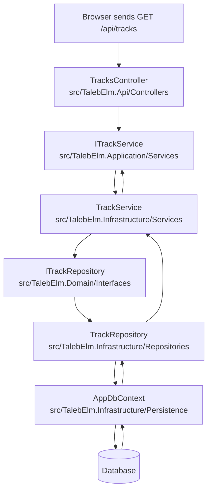

# TalebElm — The Request Lifecycle (Who talks to whom)

> **Read this first:** this page explains, in very simple terms, the path a web
> request travels through our **Clean Architecture** — from the user's browser
> all the way to the database, and back.

---

## The one rule (from `ARCHITECTURE.md`)

> **Each layer knows only about the layer inside of it. No layer reaches into
> the wrong place to do another layer's job.**

The layers are nested like a box inside a box:

```
           +------------------+
           |        Api       |  <-- the door (web requests)
           +------------------+
                    |
           +------------------+
           |  Infrastructure  |  <-- the how (database, outside tools)
           +------------------+
                    |
           +------------------+
           |    Application   |  <-- the work (use cases)
           +------------------+
                    |
           +------------------+
           |      Domain      |  <-- the rules (entities, interfaces)
           +------------------+

  Every request enters from the TOP and travels INWARD,
  then carries the answer back OUTWARD.
```

- The **Api** is the only layer the outside world talks to.
- Requests always go **inward**. Answers come back **outward** the same way.
- An **interface** is like a handshake contract: the outer layer says "I need
  someone who can save tracks" and the inner layer that actually does the work
  agrees to that contract.

---

## The generic "path" of one request

```
Web Request
    │
    ▼
API Controller        (receives the HTTP call)
    │
    ▼
Application Service   (interface: "what can we do", i.e. the contract)
    │
    ▼
Application Service   (implementation: does the real work)
    │
    ▼
Repository            (interface: "give me a way to read tracks")
    │
    ▼
Repository            (implementation: talks to the database)
    │
    ▼
AppDbContext          (Entity Framework Core)
    │
    ▼
Database
```

The **interfaces** in this path are the secret to Clean Architecture: the Api
never needs to know *who* implements the service, and the service never needs
to know *which* database or *how* queries run. Everyone depends on a
contract, not on a specific person. That makes the code easy to swap, test,
and understand.

---

## Concrete example: `GET /api/tracks`

The user's browser asks for "all tracks". Here is the exact trip, file by
file, using the exact files we are creating in the task list:



### Step by step

| # | Layer | File (from the task list) | What it does |
|---|---|---|---|
| 1 | **Api** | `Controllers/TracksController.cs` (Task 36) | Receives the HTTP request `GET /api/tracks`. It is thin: it does not fetch data itself. It only asks the service for the list. |
| 2 | **Application** | `Services/ITrackService.cs` (Task 24) | The **contract** (interface). It says: "anyone who wants to be the track service must be able to give back all tracks." |
| 3 | **Infrastructure** | `Services/TrackService.cs` (Task 35) | The **implementation**. This class agrees to the contract and does the real work. It decides the data needs a repository and asks for it. |
| 4 | **Domain** | `Interfaces/ITrackRepository.cs` (Task 14) | The **contract** for storage. It lives in Domain because Domain says *what* a track is; it does not say *how* to store it. |
| 5 | **Infrastructure** | `Repositories/TrackRepository.cs` (Task 32) | The **implementation**. This class agrees to the contract and knows the *how*: it talks to `AppDbContext`. |
| 6 | **Infrastructure** | `Persistence/AppDbContext.cs` (Task 26) | Entity Framework Core's door to the database. Runs the query and hands back the track rows. |

Then everything travels **back the same way**: `TrackRepository` shapes the
rows, `TrackService` turns them into response objects (DTOs), and
`TracksController` sends them back to the browser as JSON.

### Who never talks to whom

- The browser **never** talks to the database.
- `TracksController` **never** talks to `TrackRepository` directly.
- `TrackService` **never** knows SQL or which database is installed.
- Domain **never** imports anything from Api, Infrastructure, or Application.

Every conversation happens through the handshake of an **interface**, and the
request is passed one step at a time. That is what keeps the layers clean and
easy for beginners to learn from.