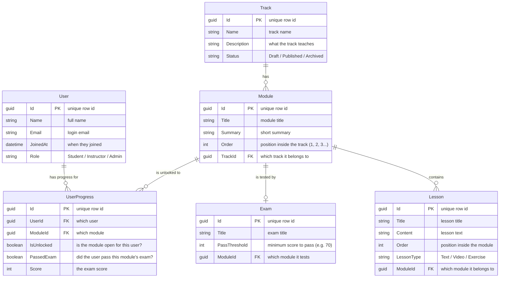

# TalebElm Database — Entity Relationship Diagram (ERD)

> **Read this first:** this page uses **Mermaid.js** diagrams. On GitHub (and
> most Markdown viewers) the diagram below renders automatically as a picture.
> Below the diagram we explain, in plain English, how the tables connect and
> how the **"progression lock"** feature works.

---

## 1. The Entity Relationship Diagram (ERD)

### What the symbols mean

| Symbol | Meaning |
|---|---|
| `||--o{` | **One-to-many** (one row on the left has many rows on the right) |
| `||--o|` | **One-to-one** (one row on the left has exactly one related row) |
| `PK` | Primary Key — the unique id of each row |
| `FK` | Foreign Key — the id that points to a row in another table |

---

## 2. How the tables connect

Think of the app as a **library with a lock on every room**.

- **Track** is the big shelf. A track holds many **Modules** (chapters). One
  track → many modules.
- **Module** is one chapter. A module holds many **Lessons** (pages). One
  module → many lessons. Every lesson knows its module because it stores the
  module's id (`ModuleId`).
- **Module** also has one **Exam**. You must pass this exam before you are
  allowed to move on to the next chapter.
- **User** is the reader. The library keeps a card for every reader.
- **UserProgress** is the reader's library card for each chapter. One row per
  user per module. It remembers:
  - `IsUnlocked` — was this chapter opened for the user (yes/no)?
  - `PassedExam` — did the user pass this chapter's exam (yes/no)?
  - `Score` — the exam score, as a number.

### How the "progression lock" works

The most important rule: **you cannot open chapter 3 until you pass the exam
at the end of chapter 2.**

Here is exactly what happens, step by step:

1. A user opens a track. The app looks at the modules in order of their `Order`
   number (1, 2, 3...).
2. Module 1 has `UserProgress.IsUnlocked = true` for everyone, so everyone can
   start at the beginning.
3. The user reads the lessons of Module 1, then takes Module 1's **Exam**.
4. The app checks the user's `Score` against the exam's `PassThreshold`
   (for example, `Score >= 70`).
   - If the score is **too low** → `PassedExam = false`. The user can retry.
   - If the score is **high enough** → `PassedExam = true`.
5. When `PassedExam = true`, the app creates/updates a `UserProgress` row for
   the **next** module with `IsUnlocked = true`.
6. Module 2 is now open. Module 3 stays locked until Module 2's exam is passed.

Why it works: the lock is stored **per user, per module** in `UserProgress`,
not inside the module itself. Two users can be in the middle of the same track
while being at different points — one is on Module 1, the other on Module 4.
The rules never depend on a shared "global" position, so nobody can hop ahead
and nobody can be blocked by someone else's progress.

---

## 3. Notes for the MVP

- **Exam** and **UserProgress** are planned for the MVP but are not yet in
  `AVAILABLE_TASKS.md`. The current task list covers `User`, `Track`, `Module`,
  and `Lesson` (Tasks 2–5). Exam and UserProgress should be added to the task
  list in the Domain phase (`entity`, `layer:domain`) before the database
  phase (Tasks 26–30) is started.
- Roles and statuses use enums already planned in the task list: `UserRole`
  (`Student`, `Instructor`, `Admin`), `TrackStatus` (`Draft`, `Published`,
  `Archived`), and `LessonType` (`Text`, `Video`, `Exercise`).